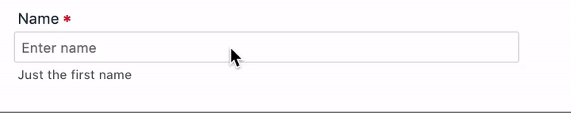

# 🚩Let's build a lean UI kit

## What is it

**fw-uikit** aims to build a minimal set of lean and light-weight UI components. 

Here's a sample, a simple input field web component built using StencilJS.This can be themed with variable CSS.

## What we will be building

- TextField (Input)
- Button
- Spinner
- TextArea 
- CheckBox
- RadioButton
- Select
- Image
- Table
- Datepicker

## To Contribute

1. Fork this repo
2. Run `npm install --dev`
3. You can find the component view and css under the respective component directory. For example, in the case of *Input* field, You can find it under `src/components/fw-input/fw-input.tsx` and `src/components/fw-input/fw-input.css` respectively. 
4. You can make changes based on the issue/ suggestion 🎉 following the [StencilJS documentation](https://stenciljs.com/docs/component)
4. Once you have made the changes, run using `npm start`
5. You can test the components by making changes to `src/index.html`
6. Raise a PR from the feature branch to `dev` branch
7. Changes (if any) will be suggested before approval. Please be kind enough to make them
8. Once the changes are done. The PR will be merged ⚡️

Thanks for contributing. Mention your name in the PR so that I can list in the contributors section ♥️

## Contributors
- [kaskar2008](https://github.com/kaskar2008)
- [atrievel](https://github.com/atrievel)
- [aachh](https://github.com/aachh)
