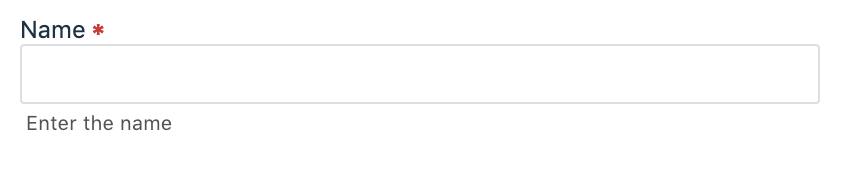

# fw-input
## What is it

A simple input field web component built using StencilJS.This can be themed with variable CSS.

## To Contribute

1. Fork this repo
2. Run `npm install`
3. You can find the component view and css under `src/components/fw-input/fw-input.tsx` and `src/components/fw-input/fw-input.css` respectively. 
4. You can make changes based on the issue/ suggestion 🎉 following the [Stencil documentation](https://stenciljs.com/docs/component)
4. Once you have made the changes, run using `npm start`
5. Raise a PR from the feature branch to `dev` branch
6. Changes (if any) will be suggested before approval. Please be kind enough to make them
7. Once the changes are done. The PR will be merged ⚡️

Thanks for contributing 💯
